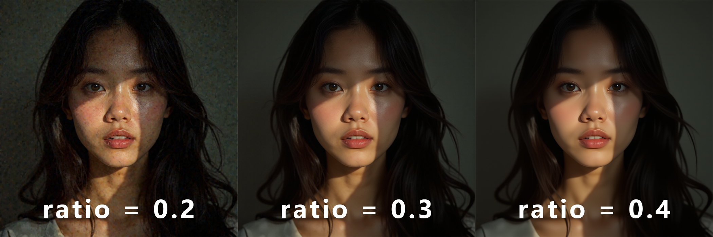
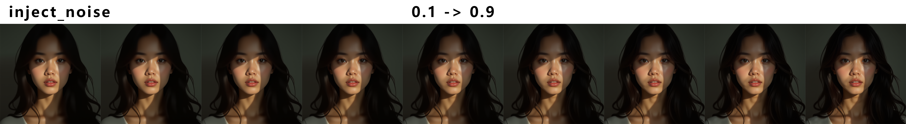
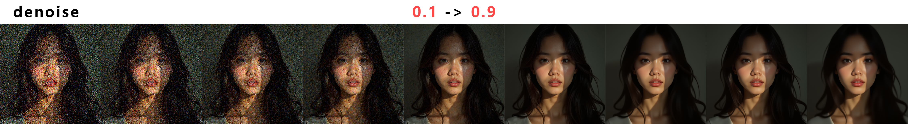

## Node Introduction
This node is used to enhance image details. We can add a latent space image and introduce any amount of noise. Then, we can start denoising at any timestep. This allows us to add more details to the image while maintaining overall consistency as much as possible.

## How to control?
In the example workflow, there are three recommended adjustment parameters. Ratio controls the step at which we start denoising. For example, if the total number of steps is 30 and we set it to 0.1, it means denoising starts at step 30 × 0.1, which is the 3rd step, leaving 27 steps for denoising. Denoise controls the denoising strength during this period. Inject_noise controls the amount of noise to be added.

Different images will not have the same parameters, but we can determine the limits of an image through testing. For example, in the image below

When the total number of steps is 30 and ratio = 0.2, we simulate the model's denoising process from step 24 to 30. In this case, the model cannot completely remove the added noise, making the leftmost image less ideal. On the other hand, in the rightmost image where ratio = 0.4, the model denoises from step 18 to 30. While it successfully removes all the noise, some image details are lost. Therefore, in this test, ratio = 0.3 serves as the optimal limit—it maximizes detail retention while ensuring effective denoising.

### Test Cases all step = 30

# inject_latent_noise 0.1 -> 0.9 ratio = 0.6 denoise = 0.6

# denoise 0.1 -> 0.9 inject = 1 ratio = 0.6

# ratio 0.1 -> 0.9 denoise = 0.6 inject = 1

